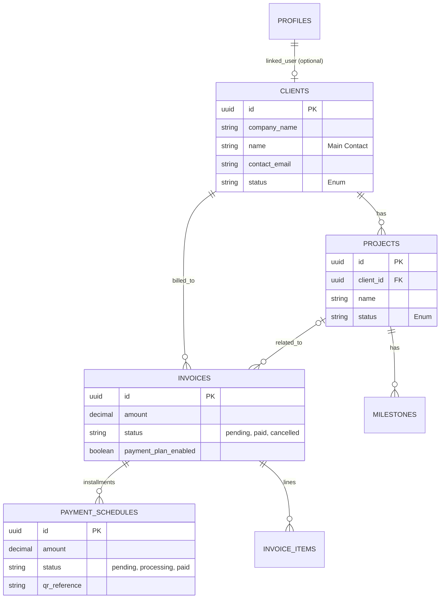

# Lopes2Tech Platform V2 - Database Schema & Architecture

> **Source of Truth:** This document allows admins to understand the data model, create records manually without errors, and debug issues.
> **Last Updated:** January 2026

---

## 1. Overview

The platform is built on **Supabase (PostgreSQL)**. It manages Clients, Projects, Invoices, and Payments.
Data access is secured via **Row Level Security (RLS)** using two main roles:
*   **Admins:** Full access.
*   **Clients:** Read-only access to their own data only.

---

## 2. Entity Relationship Diagram (Conceptual)



---

## 3. Table Definitions

### A) Clients (`clients`)
The core entity. Can be a company or individual.

| Column | Type | Nullable | Description/Constraint |
| :--- | :--- | :--- | :--- |
| `id` | UUID | NO | Primary Key (auto-gen) |
| `company_name` | TEXT | **YES** | Official entity name. |
| `name` | TEXT | NO | Main contact person name. |
| `contact_email` | TEXT | NO | Primary email for correspondence. |
| `status` | TEXT | NO | Default: `'lead'`. See Enums. |
| `street_address` | TEXT | YES | For billing. |
| `city` | TEXT | YES | |
| `postal_code` | TEXT | YES | |
| `country` | TEXT | YES | Default: `'Switzerland'`. |
| `preferred_language`| TEXT | YES | `en`, `de`, `fr`, `pt`. Default: `en`. |
| `user_id` | UUID | YES | Link to `auth.users` for Client Portal access. |
| `stripe_customer_id` | TEXT | YES | Link to Stripe Customer. |

> **⚠️ Critical:**
> *   `status` MUST be one of: `'lead'`, `'pre-approval'`, `'in-development'`, `'completed'`, `'maintenance'`, `'inactive'`, `'churned'`.
> *   **Do NOT use 'active'**. Use `'in-development'` or `'maintenance'` instead.

---

### B) Projects (`projects`)
Work being done for a client.

| Column | Type | Nullable | Description/Constraint |
| :--- | :--- | :--- | :--- |
| `id` | UUID | NO | Primary Key. |
| `client_id` | UUID | NO | Foreign Key -> `clients.id`. |
| `name` | TEXT | NO | Project Title (e.g., "Website V1"). |
| `description` | TEXT | YES | Scope summary. |
| `status` | TEXT | NO | Default: `'active'`. Enum: `'active'`, `'completed'`, `'on-hold'`. |
| `progress` | INT | NO | 0-100. Default: 0. |

> **Notes:**
> *   There is no `currency` or `budget` column on the `projects` table (removed in recent migrations). Put budget details in `description` or use Proposals/Invoices.

---

### C) Invoices (`invoices`)
Billing records.

| Column | Type | Nullable | Description/Constraint |
| :--- | :--- | :--- | :--- |
| `id` | UUID | NO | PK. |
| `client_id` | UUID | NO | FK -> `clients.id`. |
| `project_id` | UUID | YES | FK -> `projects.id`. Optional. |
| `amount` | DECIMAL | NO | Total Invoice Amount (CHF). |
| `status` | TEXT | NO | Enum: `'pending'`, `'paid'`, `'cancelled'`. |
| `payment_plan_enabled`| BOOL | NO | Default: `false`. If true, use Schedules. |
| `due_date` | DATE | YES | |
| `stripe_payment_intent_id`| TEXT | YES | If paid via Stripe online. |

---

### D) Payment Schedules (`invoice_payment_schedules`)
Partial payments/installments only used when `invoices.payment_plan_enabled = true`.

| Column | Type | Nullable | Description/Constraint |
| :--- | :--- | :--- | :--- |
| `id` | UUID | NO | PK. |
| `invoice_id` | UUID | NO | FK -> `invoices.id`. |
| `installment_number` | INT | NO | 1, 2, 3... |
| `amount` | DECIMAL | NO | Amount for this specific tranche. |
| `due_date` | DATE | NO | |
| `status` | TEXT | NO | Enum: `'pending'`, `'processing'`, `'paid'`, `'overdue'`. |
| `qr_reference` | TEXT | YES | Unique 27-digit QR ref for this installment. |

> **⚠️ Critical:**
> *   The sum of all schedule `amount`s MUST equal `invoices.amount`.
> *   `status='processing'` is used when a client clicks "I have paid".

---

## 4. Key Enums & Constraints

### Client Status
```sql
CHECK (status IN ('lead', 'pre-approval', 'in-development', 'completed', 'maintenance', 'inactive', 'churned'))
```

### Project Status
```sql
CHECK (status IN ('active', 'completed', 'on-hold'))
```

### Invoice Status
```sql
create type invoice_status as enum ('pending', 'paid', 'cancelled');
```

---

## 5. Security Model (RLS)

*   **Admins:** Have `role = 'admin'` in `public.profiles`. Can **INSERT/UPDATE/DELETE** everything.
*   **Clients:**
    *   Matched by `auth.uid() = clients.user_id` OR `auth.email = clients.contact_email`.
    *   **READ ONLY** access to their own:
        *   `clients` (profile)
        *   `projects`
        *   `invoices`
        *   `invoice_payment_schedules`
        *   `documents`
    *   **UPDATE** access limited to specific fields (e.g., `invoice_payment_schedules.status` -> `'processing'`).

---

## 6. How to Insert Data Manually (Scripting)

### Creating a Client
1.  **Check duplicates** by `contact_email` first.
2.  **Fields:** Ensure `status` is valid (e.g., `'in-development'`).
3.  **Address:** Use `street_address` (not `address`).
4.  **Name:** Use `name` (full name), not `first_name`/`last_name`.

### Creating an Invoice with Plan
1.  Insert `invoices` row with `payment_plan_enabled = true`.
2.  Calculate total amount.
3.  Insert multiple rows into `invoice_payment_schedules` referencing the `invoice_id`.
4.  Ensure `sum(schedules.amount) == invoice.amount`.
